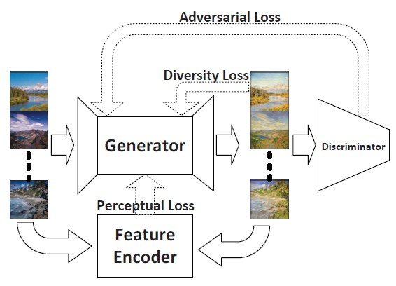

# Style-GAN

Aquest repositori conté una implementació en Pytorch d'una algoritme per la transferència d'estil artístic a través una xarxa generativa adversarial (GAN).

El model utilitzant es troba descrit a [Artsy–GAN: A style transfer system with improved quality, diversity and performance](https://doi.org/10.1109/icpr.2018.8546172).

L'objectiu del model és aprendre un mapeig d'un domini __X__ a un domini __Y__.

El model consta d'un generador i un discriminador. L'objectiu del generador és aprendre a generar imatges indistingibles de les imatges reals del domini __X__. L'objectiu dels discriminador és aprendre a detectar quan una imatges generada pel generaror és real o falsa. Per tant, es tracta d'un aprenentatge contraposat on l'objectiu és adquirir l'equilibre entre discriminador i generador.

La funció objectiu conté tres tipus de termes: pèrdua adversativa, per fer coincidir la distribució d’imatges produïdes i el domini objectiu, la pèrdua perceptiva per mantenir l’objecte i el contingut en les sortides i la pèrdua de diversitat per millorant la diversitat de les imatges generades.

Aquest sistema es troba esquematitzat en la següent imatge:

<p align="center">
    
</p>

## Requeriments

El programa es troba escrit en Python i utilitza [Pytorch](http://pytorch.org/). 

## Datasets

Per construir els models hem utilitzat els següents conjunts d'imatges:

* vangogh: Extret del projecte [CycleGan](https://github.com/junyanz/pytorch-CycleGAN-and-pix2pix)
* picasso: Extret mitjançant la API de repositori web [WikiArt](https://www.wikiart.org/).
* pollock: Extret mitjançant la API de repositori web [WikiArt](https://www.wikiart.org/).

Per tal d'utilitzar l'API de WikiArt, s'ha implementat el codi datasets.py ubicat en la carpeta [wikiArt](wikiArt).

## Entrenament

Pel tal d'entrenar el model, s'executa els arxius main.py o main_wchr.py amb els següents paràmetres:
* `--n_epochs`: Nombre de èpques d'entrenament, per defecte 200.
* `--epoch`: Època en que comença l'entrenament, per defecte 0.
* `--batch-size`: Mida del batch d'entrenament, per defecte 1.
* `--dataset`: Ruta de la carpeta que conté el conjunt d'entrenament. Obligatori.
* `--dataset_name`: Nom del tipus de conjunt d'entrenament. Obligatori.
* `--save-model-dir`: Ruta a la carpeta on es desarà el model entrenat. Obligatori.
* `--image-size`: Mida de les imatges d'entrenament, per defecte 256.
* `--cuda`: Runtime utilitzat en l'entreanment. S'informa 1 per executar sobre GPU, 0 per CPU. Obligatori.
* `--seed`: Semilla aleatòria per l'entrenament, per defecte 42.
* `--lr`: Taxa d'aprenentatge, per defecte 2e-4")
* `--b1`: En l'optimitzador, decaïment del moment de gradien de primer ordre, per defecte 0.5
* `--b2`: En l'optimitzador, decaïment del moment de gradien de primer ordre, per defecte 0.999
* `--decay_epoch`: Època en la qual comença el decaïment de la taxa d'aprenentatge, per defecte 100.
* `--content-weight`: Pes de la pèrdua de contingut, per defecte 1.

La diferència entre main.py i main_wchr.py, radica en l'estructura del generador utilitzat. Com s'explica més endavant, l'arxiu main.py utilitza la estructura descrita a l'arxiu generator.py, mentre que, l'arxiu main_wchr.py utilitza la estructura descrita a l'arxiu generator_wchr.py

### Imatges d'entrada

L’entrada del generador és una imatge de color en format RGB. El conjunt d'imatges es recull mitjançant `ImageFolder`, aplicant les següents transformacions:

```python
	transform = transforms.Compose([
        transforms.Resize(args.image_size),
        transforms.CenterCrop(args.image_size),
        transforms.ToTensor(),
    ])
```

Aquestes trasnformacions, redimensionen les imatges d’entrada posant en l’eix més curt la dimensió informada en el paràmetre d’entrada __image_size__, es retallen les imatges redimensionades com un quadre de dimensions ( __image_size__, __image_size__ ) centrat en la imatge i es converteixen en un Tensor amb les dimensions (C x H x W) en el rang [0.0, 1.0].

Amb les imatges carregades i transformades, es genera un __loader__ mitjançant `DataLoader` aplicant el __batch-size__ informat com a paràmetre.

### Generador

Es defineixen dues estructures de generador: generator_wchr.py i generator.py

#### generator_wchr.py

L’estructura del generador és molt similar a la descrita per Johnson et al. a [Perceptual Losses for Real-Time Style Transfer and Super-Resolution](https://arxiv.org/abs/1603.08155).

Conté tres blocs de downsampling seguits per una capa de [Instance Normalization](https://arxiv.org/pdf/1607.08022.pdf) cadascun d’ells, cinc [blocs residuals](https://doi.org/10.1109/cvpr.2016.90), dos blocs de upampling seguits per una capa de normalització d’instància [Instance Normalization](https://arxiv.org/pdf/1607.08022.pdf) cadascun d’ells i una capa convolucional de sortida. Tots els blocs de downsampling i upsampling apliquen com a funció d’activació la funció d’unitat lineal rectificada per elements.

Les capes convolucionals dels blocs de downsampling tenen la següent estructura:

1.Es carrega el tensor d’entrada mitjançant la reflexió del límit d’entrada.
2.S’aplica una convolució 2D sobre el tensor d’entrada compost per diversos plans d’entrada.

Els blocs residuals es construeixen amb dues capes convolucionals com les anteriors, amb els mateixos canals d’entrada i sortida, i una mida de Kernel igual a 3, seguides d’una capa de normalització d’instància. En el primer grup de capes dels blocs residuals s’aplica la funció d’unitat lineal rectificada per elements com a funció d’activació.

Les capes convolucionals dels blocs de upsampling tenen la mateixa estructura que les capes de downsampling, però s’aplica una augment de resolució d’entrada al factor d’escala donat.

#### generator.py

Es modifica l’estructura del generador_wchr per tal d’aplicar un chroma subsampling als canals de color. És a dir, es deixen les mateixes capes pel canal 1 de luminància, i es substitueix el primer block de downsampling i l’últim de upsampling per l’estàndard corresponent en els canals 2 i 3 de cromància.

### Discriminador

L’estructura del discriminador, descrita en l'arxiu discriminator.py, és la mateixa que la descrita per les Cycle-GAN en l’article [Unpaired Image-to-Image Translation Using Cycle-Consistent Adversarial Networks](https://doi.org/10.1109/iccv.2017.244), utilitzant [Patch-GAN](https://doi.org/10.1109/cvpr.2017.632) de 70x70. 

Conté una capa convolucional amb la versió Leaky de la funció d’unitat lineal rectificada per elements com a funció d’activació i tres capes com l’anterior però intercalant una capa de normalització d’instància. Posteriorment s’emplenen els límits del tensor d’entrada amb zeros i per últim una capa convolucional.

### Optimitzadors

S’utilitzen optimitzadors d’Adam, tant pel generador com pel discriminador amb el paràmetres `--lr` com a taxa d'aprenentatge i, `--b1` i `--b2` coma a betas. 

Es defineixen uns programadors per aplicar un decaïment en la taxa d’aprenentatge amb el paràmetres `--n_epochs`, `--epoch` i `--decay_epoch`. 

### Funcions de pèrdua

Es defineixen 3 funcions de pèrdua: pèrdua adversarial, pèrdua perceptiva i pèrdua de diversitat. La pèrdua total esdevé una combinació de les anteriors.

#### Pèrdua adversarial

S’aplica pèrdues adversarials de mínims quadrats de la GAN a la funció de mapeig  i al seu discriminador.

L’objectiu del generador és:


on __z__ és el tensor del soroll,  és l’etiqueta per les dades reals. __G__ tendeix a produir imatges __G(x,z)__ que s’assemblin a les imatges del domini __Y__. La pèrdua adversarial aplicada al generador s’implementa de la següent forma:

```python
	adversarial_loss = mse_loss(discriminator(fake_imgs), valid)
```
on __fake_imgs__ son les imatges resultat del generador i __valid__ l’etiqueta per les dades reals.

L’objectiu del discriminador és:


on   és l’etiqueta per les dades falses. El discriminador intenta distingir entre les imatges traslladades __G(x,z)__ i les imatges reals __y__, és a dir:

```python
	real_loss = mse_loss(discriminator(real_imgs), valid)
	fake_loss = mse_loss(discriminator(fake_imgs.detach()), fake)
	loss_D = 0.5 * (real_loss + fake_loss)
```

#### Pèrdua perceptiva

S’aplica la funció perceptiva descrita en l’article de [Johnson et al](https://arxiv.org/abs/1603.08155) per mesurar les diferencies semàntiques i perceptives entre les imatges. 

Una xarxa de codificació de característiques entrenat per la classificació d’imatges s’utilitza per extreure les característiques perceptives de les imatges. Sigui  les sortides de la capa __j-èssima__ de la xarxa de codificació de característiques  en processar la imatge __x__. Si __j-èssima__ és una capa convolucional,  seria un mapa de característiques de la forma . Llavors la pèrdua perceptiva del generador és la distància Euclidiana entre representacions de característiques:


S’ha utilitzat una xarxa VGG-19 preentrenada en ImageNet com a xarxa de codificació de característiques.

El càlcul de la pèrdua perceptiva es realitza de la següent manera:

```python
	gen_features = features_extractor(fake_imgs_perceptual)
	real_features = features_extractor(real_imgs_perceptual)
	perceptual_loss = args.content_weight * mse_loss(gen_features.relu2_2, real_features.relu2_2)
```

#### Pèrdua de diversitat

Per poder plasmar la diversitat del dataset d’entrada en la generació de sortides, s’introduieix soroll a l’entrada dels nostres sistemes. Com realitza Ulyanov en [Texture Networks](https://arxiv.org/pdf/1603.03417.pdf), s’utilitza una funció objectiva que pot afavorir la diversitat en la transferència d'estil, descrita com:


on __N__ és el nombre de sorolls d’entrada i també el nombre de sortides,  és el pes de la pèrdua de diversitat en la pèrdua total, i __g(x)__ és la xarxa per produir les imatges estilitzades.

En aquest cas es proposa una nova funció de pèrdua per fomentar la diversitat en la traducció d’imatge a imatge. Es mesura la mitjana de la distància entre les imatges de sortida i s’utilitza la reciprocitat per maximitzar-la. La pèrdua de diversitat ve donada per:


  
Per tal de calcular la pèrdua de diversitat, creem dos nous tensors a partir del input afegint-li soroll gaussià:

```python
	z = Variable(AddGaussianNoise(0,1).__call__(x).type(Tensor))
	z_2 = Variable(AddGaussianNoise(0,1).__call__(x).type(Tensor))
```

Aquest tensors amb soroll, es passen per la xarxa del generador i és calcula la pèrdua de diversitat de la següent manera:

```python
	fake_diversity = generator(z)
	fake_diversity_2 = generator(z_2)
	diversity_loss = 0.5 * torch.reciprocal(l1_loss(fake_diversity, fake_diversity_2))
```

#### Pèrdua Total

La pèrdua total a minimitzar, en el cas del generador quedaria:


On  és igual a __1e-2__ i  igual a __1e-2__.

En el cas del discriminador, l’objectiu és minimitzar la perdia adversarial plantejada anteriorment.

## Evaluació

Pel tal d'evaluar el model i realitzar la transferència d'estil, s'executa l'arxiu main.py (o main_wchr.py, segons com s'hagi entrenat el model) amb els següents paràmetres:

* `--content-image`: Ruta i nom de la imatge que volem estilitzar.
* `--content-scale`: Factor de disminució de la imtages a estilitzar, per defecte None.
* `--output-image`: Ruta i nom de la imatge de sortida.
* `--model`: Ruta i nom del model que es vol utilitzar per l'estilització. 
* `--cuda`: Runtime utilitzat en l'estilització. S'informa 1 per executar sobre GPU, 0 per CPU. Obligatori.

## Resultats

